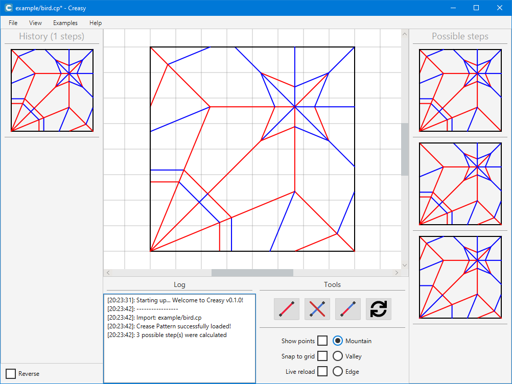

  
   
  <h1 align="center">Creasy: Turn Crease Patterns into Instructions</h1>

Creasy is a software tailored to computational origami which implements an algorithm that turns **flat-foldable** crease patterns into folding sequences / instructions.
This algorithm is based on the works of
- Hugo A. Akitaya
- Jun Mitani
- Yoshihiro Kanamori
- Yukio Fukui

and their paper "**Generating Folding Sequences from Crease Patterns of Flat-Foldable Origami**".

(Creasy after importing a crease pattern, gui elements are explained below)

## Description
Creasy tries to make the deciphering of crease patterns simple and understandable in its GUI. Once you open Creasy, you are welcomed by a few elements that might confuse you at first.
On the left is your **history** aka the set of instructions you have saved. 

On the right are all the possible simplification steps the algorithm is able to generate for the currently loaded crease pattern. If you click on one of these steps, it will add that step to your **history** and generate new simplification steps of which you can see the difference by hovering over them. 

In the middle there is the main canvas displaying your currently loaded crease pattern, in which you can freely move around, or zoom, or change the grid size.
These options are also accessible in the menubar under **View**.

Finally, on the bottom, you have a log showing you what's happening at all times and some very basic editing tools to add or remove creases, change crease types, show vertices, etc.

This allows you to put together the generated folding sequences as you like and export them as needed.

## Installation
**JDK 16 or above** is needed to run or compile Creasy.

You can either download a pre-built binary (`.jar`) from the release page or compile manually.
If you choose to compile Creasy yourself, you will also need `maven`.

- Clone the repository with `git clone git@github.com:xkevio/Creasy.git`
- Open the project in your IDE or head into the main directory
- Execute the command `mvn clean package` either in your IDE or terminal

This will generate a `target` folder inside of the cloned directory which contains an executable `.jar` file.

## Features
- Simplifying crease patterns according to the aforementioned algorithm as far as possible
- Putting the generated folding sequences together in whatever order you like
- **Exporting the instructions as either `.pdf` or `.svg`**
- Exporting the crease pattern as either `.pdf`, `.svg` or `.png`
- Adding creases, removing creases, changing crease types
- Previewing the folded model thanks to **[Oripa](https://github.com/oripa/oripa)**
- *etc...*

## Contributing
Pull requests are welcome. For major changes, please open an issue first to discuss what you would like to change.

The implementation of the algorithm or even the way the code is structured certainly isn't the best way to do it, so we are open to criticism.

## License
This software is licensed under the GPL3 license.
